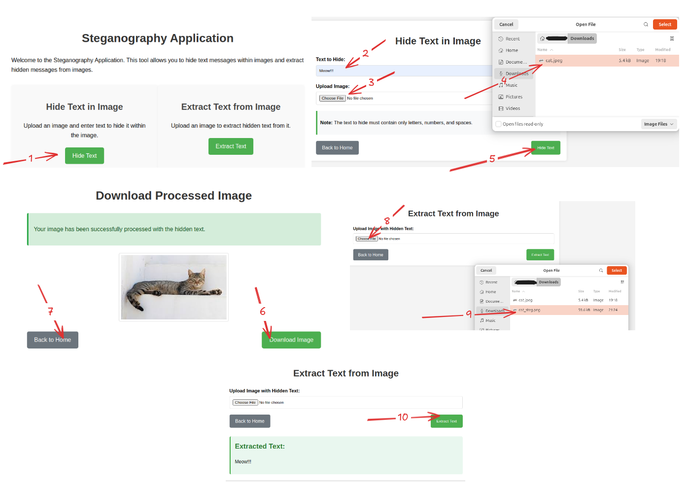

# Steganography Application

A Java-based application for hiding text messages within images using steganography techniques. This application provides both a web-based GUI and a REST API for encoding and decoding hidden messages.



## What is Steganography?

Steganography is the practice of concealing a message within another non-secret file or message. In this application, we use the least significant bit (LSB) technique to hide text messages within image files without noticeably altering the image's appearance.

## Features

- Hide text messages within images
- Extract hidden text from images
- User-friendly web interface
- REST API for programmatic access
- Support for various image formats (outputs as PNG)

## Tech Stack

- Java 11
- Spring Boot 2.4.5
- Thymeleaf for HTML templates
- Lombok for reducing boilerplate code
- Spring Boot Actuator for application monitoring
- Spring Boot DevTools for development
- JUnit for testing

## Getting Started

### Prerequisites

- Java 11 or higher
- Gradle (or use the included Gradle wrapper)

### Running the Application

1. Clone the repository
2. Navigate to the project directory
3. Run the application using Gradle:

```bash
./gradlew bootRun
```

The application will start on port 8081 by default. You can access the web interface by navigating to `http://localhost:8081` in your web browser.

## Using the Web Interface

### Home Page

The home page provides options to either hide text in an image or extract text from an image.

### Hiding Text in an Image

1. Click on the "Hide Text" button on the home page
2. Enter the text you want to hide (only letters, numbers, and spaces are allowed)
3. Upload an image file
4. Click the "Hide Text" button
5. On the download page, you can preview the processed image and download it

### Extracting Text from an Image

1. Click on the "Extract Text" button on the home page
2. Upload an image that contains hidden text
3. Click the "Extract Text" button
4. The extracted text will be displayed on the page

## Using the REST API

The application also provides a REST API for programmatic access.

### Hide Text in Image

```bash
curl -X POST \
  -F "image=@path/to/your/image.jpg" \
  http://localhost:8081/steg/YourTextHere \
  --output output_image.png
```

This command will:
- Take your image file
- Hide the specified text in it
- Save the resulting image as output_image.png in the current directory

### Extract Text from Image

```bash
curl -X POST \
  -F "image=@path/to/your/steg_image.png" \
  http://localhost:8081/desteg
```

This command will:
- Take your steganography image
- Extract the hidden text from it
- Display the extracted text in the terminal

## Example with Sample Image

The repository includes a sample cat image for testing:

### Hide Text in the Sample Image

```bash
curl -X POST \
  -F "image=@src/test/resources/cat.jpeg" \
  http://localhost:8081/steg/HelloCat \
  --output steg_cat_output.png
```

### Extract Text from the Processed Image

```bash
curl -X POST \
  -F "image=@steg_cat_output.png" \
  http://localhost:8081/desteg
```

## Technical Implementation

The application uses the least significant bit (LSB) technique for steganography:

1. For encoding, the text is converted to bytes, and each bit is stored in the least significant bit of a pixel's color value
2. For decoding, the least significant bits are extracted and reconstructed into the original message

The implementation includes:
- Input validation to ensure the image can hold the message
- Error handling for various edge cases
- Cross-origin support for API access

## Notes

- The text to hide must contain only letters, numbers, and spaces
- The application supports various image formats for input, but always outputs PNG files
- The GUI is responsive and works on both desktop and mobile browsers
- Make sure the application is running on port 8081
- Run API commands from the project root directory
